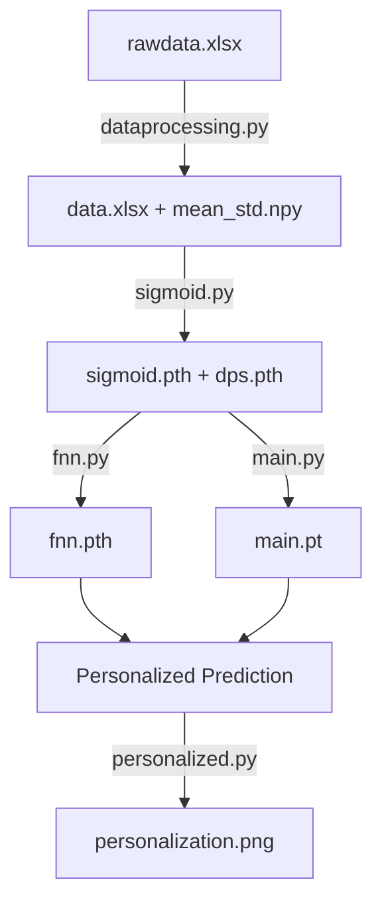

# Personalized Alzheimer's Disease Neural Network Model

A data-driven Neural ODE framework for modeling personalized biomarker trajectories in Alzheimer's disease (AD). The model learns the dynamics of four key biomarkers — Aβ (A), phosphorylated Tau (T), neurodegeneration (N), and cognition (C) — as a function of a latent **Disease Progression Score (s)**.

## Project Structure

```
├── src/                          # Python source code
│   ├── pccmnn.py                 # Shared utilities: data loading, inverse normalization
│   ├── dataprocessing.py         # Raw data preprocessing → normalized data.xlsx
│   ├── sigmoid.py                # Sigmoid curve fitting for biomarker trajectories
│   ├── fnn.py                    # FNN pipeline: pretrain + alternating optimization
│   ├── main.py                   # Main Neural ODE training pipeline
│   └── personalized.py           # Personalized model fine-tuning
├── models/                       # Trained model weights (.pth, .pt)
├── data/                         # Data files (.xlsx, .npy)
├── figures/                      # Generated figures (.png)
├── docs/                         # Manuscripts and supplementary materials
└── README.md                     # This file
```

## Pipeline Overview



### 1. Data Preprocessing (`dataprocessing.py`)
Merges ADNI clinical data (demographics, cognition, hippocampus volume) with CSF biomarker data (Aβ, p-Tau). Normalizes to z-scores and filters subjects with insufficient measurements.

**Output:** `data.xlsx`, `mean_std.npy`

### 2. Sigmoid Fitting (`sigmoid.py`)
Fits regularized sigmoid curves to population-level biomarker trajectories as a function of the disease progression score (s). Assigns initial DPS transformation parameters (s = a·t + b) per patient based on diagnostic stage.

**Output:** `sigmoid.pth`, `dps.pth`, `sigmoid.png`

### 3. FNN Pipeline (`fnn.py`)

> ⚠️ **Experimental Pipeline A** — uses 3-layer FNN without input normalization, L-BFGS alternating optimization, and biological constraints (monotonicity, plateau).

Two-stage training:
- **Stage 1:** Pretrain FNN to match sigmoid trajectories (Adam)
- **Stage 2:** Fine-tune FNN + per-patient DPS on real data (L-BFGS, Algorithm 1)

**Output:** `fnn.pth`, `pretrain_result.png`, `fnn.png`

### 4. Main Pipeline (`main.py`)

> ⚠️ **Experimental Pipeline B** — uses 2-layer FNN with Tanh output + [0,1] input normalization, Adam optimizer with exponential LR decay, and inverse-variance-weighted data L2 loss.

Trains a Neural ODE to reproduce sigmoid biomarker trajectories. Features:
- float64 precision for numerical stability
- [0,1] input normalization (population min/max)
- Multiple loss components: trajectory L2, gradient-field matching, inverse-variance-weighted L2

**Output:** `main.pt`, `main.png`, `main_loss.png`

### 5. Personalization (`personalized.py`)
Loads a pre-trained population model and fine-tunes only the most sensitive parameters for individual patients. Uses 3 training points with remaining data held out for validation.

**Output:** `personalization.png`

## Key Concepts

### Disease Progression Score (DPS)
Each patient's disease timeline is mapped to a common latent axis `s` via:
```
s = a · t + b
```
where `t` is calendar time (age), and `a`, `b` are patient-specific parameters. CN patients have slower progression (a≈1), while AD patients progress faster (a≈4).

### Four Biomarkers
| Symbol | Biomarker | Expected Trend (s↑) |
|--------|-----------|---------------------|
| A (Aβ) | Amyloid-β | ↓ Decreasing |
| T (Tau) | Phosphorylated Tau | ↑ Increasing |
| N | Neurodegeneration (Hippocampus) | ↓ Decreasing |
| C | Cognition | ↓ Decreasing |

### Neural ODE
The biomarker dynamics are modeled as:
```
dy/ds = f_θ(y)
```
where `f_θ` is a neural network. The trajectory y(s) is obtained by integrating this ODE from an initial condition using `torchdiffeq`.

## Getting Started

### Prerequisites
```bash
pip install torch torchdiffeq pandas numpy matplotlib scipy openpyxl
```

### Running the Pipeline

1. **Preprocess data:**
   ```bash
   cd src
   python dataprocessing.py
   ```

2. **Fit sigmoid trajectories:**
   ```bash
   python sigmoid.py
   ```

3. **Train Neural ODE model (choose one):**
   ```bash
   # Pipeline A: FNN with alternating optimization
   python fnn.py

   # Pipeline B: Main Neural ODE with sigmoid matching
   python main.py
   ```

4. **Personalize for individual patients:**
   ```bash
   python personalized.py
   ```

## Future Work

- **Unify pipelines:** The two experimental pipelines (`main.py` and `fnn.py`) currently use different model architectures, training strategies, and ODE model definitions. A future refactoring will unify these into a single, configurable pipeline.
- **Sensitivity analysis:** The script for computing `sensitive_params.json` is not yet included in this repository.
- **Model weight files:** `fpp.pth` and `dps_fpp.pth` (used by `personalized.py`) are produced by a separate experimental run not yet integrated.

## Data Availability

NACC data is available at [https://www.naccdata.org/](https://www.naccdata.org/).

## References

See `docs/` for the accompanying manuscript and supplementary notes.

**Citation:** Zheng, H., Petrella, J.R., Doraiswamy, P.M. *et al.* Data-driven causal model discovery and personalized prediction in Alzheimer's disease. *npj Digit. Med.* **5**, 137 (2022). [https://doi.org/10.1038/s41746-022-00632-7](https://doi.org/10.1038/s41746-022-00632-7)
